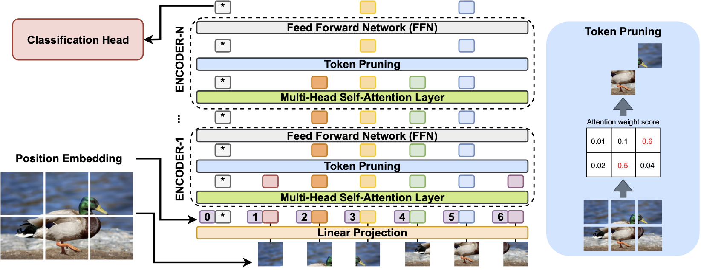

# TAVT: Token Adaptive Vision Transformer with Efficient Deployment for Fine-Grained Image Recognition

Official PyTorch code for the paper:  [*TAVT: Token Adaptive Vision Transformer with Efficient Deployment for Fine-Grained Image Recognition (DATE2023)*](https://ieeexplore.ieee.org/document/10137239)  


## Framework



## Dependencies:
+ Python 3.7.3
+ PyTorch 1.5.1
+ torchvision 0.6.1
+ ml_collections

## Usage
### 1. Download Google pre-trained ViT models

* [Get models in this link](https://console.cloud.google.com/storage/vit_models/): ViT-B_16, ViT-B_32...
```bash
wget https://storage.googleapis.com/vit_models/imagenet21k/{MODEL_NAME}.npz
```

### 2. Prepare data

In the paper, we use data from 5 publicly available datasets:

+ [CUB-200-2011](http://www.vision.caltech.edu/visipedia/CUB-200-2011.html)
+ [Stanford Cars](https://www.kaggle.com/datasets/jessicali9530/stanford-cars-dataset)
+ [Stanford Dogs](http://vision.stanford.edu/aditya86/ImageNetDogs/)
+ [NABirds](http://dl.allaboutbirds.org/nabirds)
+ [iNaturalist 2017](https://github.com/visipedia/inat_comp/tree/master/2017)

Please download them from the official websites and put them in the corresponding folders.

### 3. Install required packages

Install dependencies with the following command:

```bash
pip3 install -r requirements.txt
```

### 4. Finetune from pretrained VIT

Train baseline model from pretrained VIT. To train the baseline model on CUB-200-2011 dataset with 4 gpus in FP-16 mode for 10000 steps run:

```bash
CUDA_VISIBLE_DEVICES=0,1,2,3 python3 -m torch.distributed.launch --nproc_per_node=4 train.py --dataset CUB_200_2011 --num_steps 10000 --fp16 --name CUB_VIT_baseline
```

### 5. In-place distillation with Patch Drop

From a checkpoint finetuned with a CUB-200-2011 dataset from pretrained VIT, continue finetuning with Patch Drop. To train TAVT on CUB-200-2011 dataset with 4 gpus in FP-16 mode for 10000 steps run:


```bash
CUDA_VISIBLE_DEVICES=0,1,2,3 python3 -m torch.distributed.launch --nproc_per_node=4 train.py --dataset CUB_200_2011 --num_steps 10000 --fp16 --name CUB_VIT_adaptive --pretrained_model ./output/CUB_VIT_baseline_checkpoint.bin --do_distil
```

### 6. Run Evolutionary Search of Patch Drop configuration

After training TAVT, run an evolutionary search to find Patch Drop configurations with optimal accuracy-efficienct tradeoffs:
```bash
CUDA_VISIBLE_DEVICES=0,1,2,3 python3 -m torch.distributed.launch --nproc_per_node=4 train.py --dataset CUB_200_2011 --fp16 --name CUB_VIT_adaptive --do_search --max_seq_length 785 --pretrained_model ./output/CUB_VIT_adaptive_checkpoint.bin --eval_batch_size 16
```

## Citation

If you find our work helpful in your research, please cite it as:

```
@inproceedings{lee2023token,
  title={Token Adaptive Vision Transformer with Efficient Deployment for Fine-Grained Image Recognition},
  author={Lee, Chonghan and Brufau, Rita Brugarolas and Ding, Ke and Narayanan, Vijaykrishnan},
  booktitle={2023 Design, Automation \& Test in Europe Conference \& Exhibition (DATE)},
  pages={1--6},
  year={2023},
  organization={IEEE}
}
```

## Acknowledgement

Many thanks to [ViT-pytorch](https://github.com/jeonsworld/ViT-pytorch) for the PyTorch reimplementation of [An Image is Worth 16x16 Words: Transformers for Image Recognition at Scale](https://arxiv.org/abs/2010.11929)